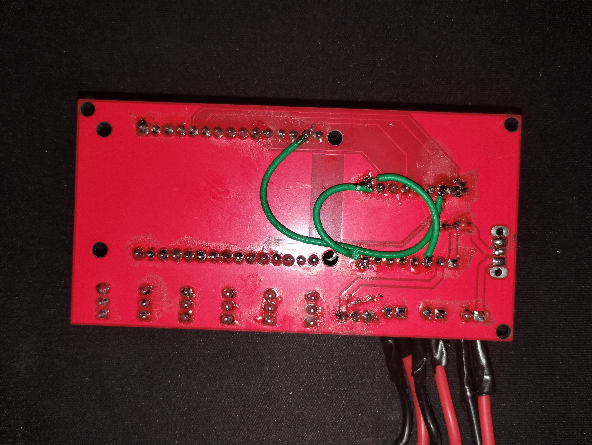

# Código Auto Raimundão

Este repositório é dedicado ao código que será usado no projeto do robô 500g autônomo chamado Raimundão. Ele utilizará ESP32 DEVKIT V1 
como a placa principal de controle, e o drive de motor TB6612FNG.

## 🈯 Placa de destino 

A placa para a qual o programa foi escrito é o OmegaKit RZ60, um dos projetos disponíveis no repositório de projetos de placas de circuito impresso disponíveis no repositório [OmegaKit MiniSumo](https://github.com/facens-omegabotz/OmegaKit_MiniSumo).

> A placa que rodou na RoboChallenge 2025. Um pouco espaçosa.

### Adaptações realizadas na placa

O projeto da placa possui uma trilha que liga um pino de entrada exclusiva (__GPIO35__) a um pino da ponte H que espera um sinal (__AIN2__). 

> Os outros fios são GNDs que não liguei no KiCad.

Com isso, fez-se a necessidade de utilizar um jumper entre __AIN2__ e o __GPIO22__. Como não tive coragem de cortar a trilha, mootores conectados à placa durante a escrita de dados no ESP32 (envio de código) se movem um pouco. Ou pode ser outro pino que não considerei.

> Eu pretendo aprender mais sobre eletrônica. A placa tem mais problemas do que esse.

## 🎨 Guia de estilos

### Código

O guia de estilos utilizado para o desenvolvimento deste código foi o [Guia de estilos do Google para C++](https://google.github.io/styleguide/cppguide.html). O código será guiado a partir deste guia e qualquer contribuição deverá atentar-se as orientações dadas neste guia.

### Commits

O padrão de commits seguido neste repositório é o mesmo [deste post no blog dev.to](https://dev.to/renatoadorno/padroes-de-commits-commit-patterns-41co), mas com algumas alterações. No caso de dois tipos de ação em um commit (ex.: documentação e implementação de feature), uma possível mensagem seria:

    git commit -m "✨📚 feat+docs(__nome do arquivo 1__, __nome do arquivo 2__,...): Implementa x, adiciona documentação para y."

A mensagem deve estar no imperativo, e os arquivos devem estar de acordo com a ordem do tipo de commit (arquivos onde estão a feature, no exemplo, viriam primeiro). Se muitos arquivos foram alterados, nomear somente os principais é o suficiente.

## 🤖 O robô

O robô desenvolvido a partir dos projetos da placa e do código é o Raimundão. É o meu primeiro robô de sumô autônomo, e seu projeto marca o retorno da equipe à categoria. Esse projeto não seria possível sem o auxílio dos membros da categoria de sumô e, em especial, sem o auxílio dos líderes das categorias de eletrônica e seguidor de linha: Rafael e Guilherme. 

> Um round contra o Magic Boo, da DragonBotz. Foi por pouco, mas levamos.

## 🤓 A lógica

Atualmente, a lógica do robô separa as tarefas entre sensoriamento e execução de estratégias. Dessa forma, com o uso de FreeRTOS, é possível delegar toda a detecção de inimigos, linha e de sinais de infravermelho para um dos núcleos, enquanto o outro núcleo se preocupa somente em enviar comandos ao motor.

Não é, necessariamente, a melhor maneira de dividir o código, mas o uso de FreeRTOS me auxiliou a implementar a lógica ao não deixá-la completamente sequencial.

### Sensoriamento

A tarefa de sensoriamento se preocupa durante toda a sua execução com o sinal de infravermelho. Ao receber o sinal __2__, o robô inicia a detecção de inimigos e de linha, setando ou limpando um bit selecionado em um __EventGroup__ dedicado de acordo com os valores obtidos.

### Movimentação

A tarefa de movimentação só existe enquanto o sinal __3__ não for recebido pelo robô, de modo que recebê-lo torne a parada permanente enquanto o robô não for desligado e ligado novamente.

A tarefa é responsável por executar a estratégia selecionada pelo operador antes da recepção do sinal __2__. As estratégias acessam os valores de detecção a partir de consultas no __EventGroup__ com um timeout de 30ms. 
